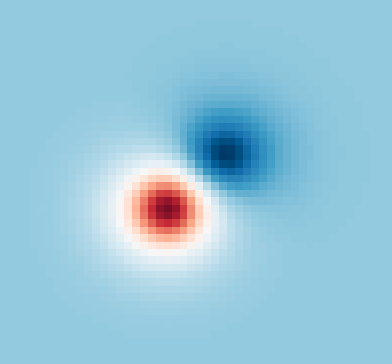

# AutoHF
<p align="center">
  <br><br>
  <br><br>
  
</p>

## Automatic Differentiation and Hartree Fock

Hartree-Fock is a method in computation quantum chemistry that treats the electrons in a molecule as a mean-field, and is able to find approximate solutions to the 
Schrodinger equation by taking linear combinations of atomic orbitals (LCAO). This package attempts to treat the HF method in a fully differentiable manner, such that all quantities calculated during Hartree-Fock can be differentiated.

## Installation

To install AutoHF, clone the repository and run:

```
python setup.py build_ext --inplace install --user
```

### 2. Code Philosophy

The main idea behind AutoHF is a mapping from fundamental objects in Hartree-Fock, to maps from a parameter space to such objects. For example, instead of treating atomic oribtals as the fundamental
object used to perform calculations in Hartree-Fock, the fundamental objects are now maps from a parameter space to the space of atomic oribtals.

AutoHF is built on top of Autograd, so we try to follow the general Autograd-philosophy as much as possible.

## To-Do

**Optimizations**

1. Using native JAX functionality to implement each of the recursive functions used to compute the integrals, so we can compile once with `jit`.

### Known Issues

TBD
